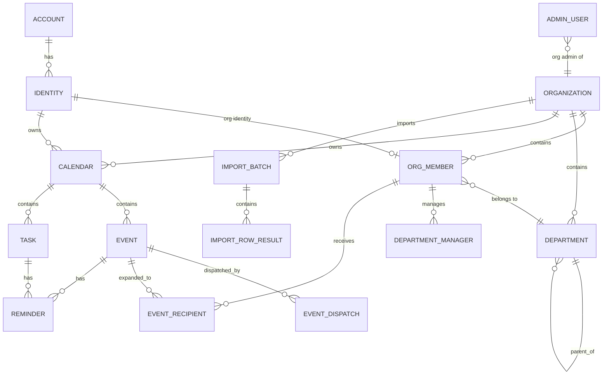
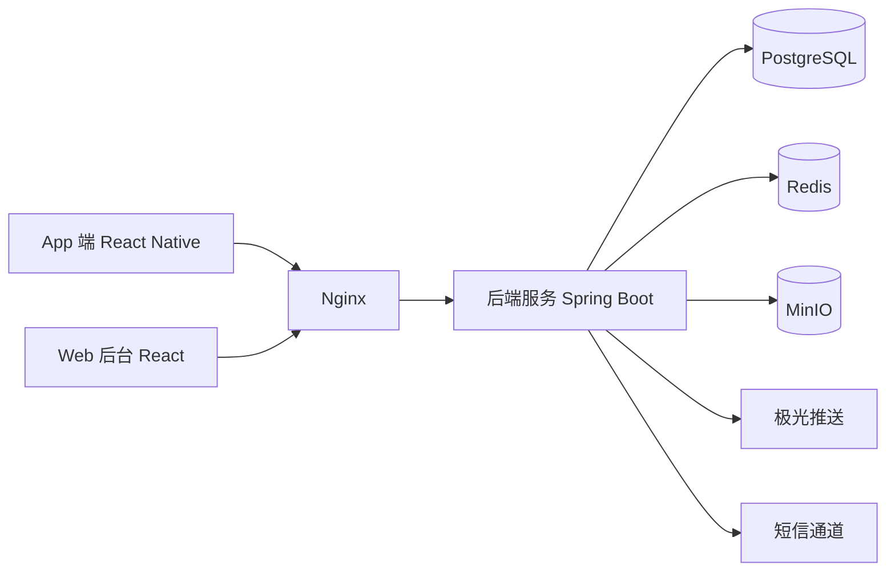

# XaTodo（心安待办）产品与技术规格说明书

| 项 | 内容 |
| --- | --- |
| 产品英文名 | XaTodo |
| 产品中文名 | 心安待办 |
| 项目代号 | `xa-todo` |
| 文档版本 | v1.1 |
| 文档状态 | 已评审，作为阶段一开发依据 |
| 适用范围 | App 端（个人 / 组织）、Web 后台（平台超管 / 组织管理员）、服务端 |

---

## 1. 产品概述与术语表

### 1.1 产品定位

XaTodo（心安待办）是一款智能日程与待办管理应用。产品围绕「让日程与待办各得其所」展开：

- **个人用户**：手动管理自己的日历日程与待办任务。
- **组织用户**：在个人能力之上，额外拥有组织管理员统一下发的组织日历日程。
- **平台运营方**：通过 Web 后台管理组织、账号、全局配置与平台数据。

首版聚焦「日程 + 待办」双模型与组织日程下发闭环，**不包含 AI 能力**，但预留接入位（见 §11）。

### 1.2 术语表

| 术语 | 英文 / 标识 | 定义 |
| --- | --- | --- |
| 账号 | Account | 登录主体，以手机号为唯一凭证。一个账号是「人」在系统中的根实体。 |
| 身份 | Identity | 账号在某个空间下的操作主体。分 `PERSONAL`（个人身份）与 `ORG_MEMBER`（组织身份）。 |
| 个人身份 | Personal Identity | 每个账号至多 1 个，拥有独立的个人日历。 |
| 组织身份 | Org Identity | 账号在某组织中的成员身份，每个账号在每个组织至多 1 个，可有多个（分属不同组织）。 |
| 组织 | Organization | 租户实体，由平台超管创建并指定首位管理员。 |
| 部门 | Department | 组织内的树形组织结构，最多 5 层。 |
| 部门管理员 | Dept Admin | 被授权管理某部门（及其所有下级部门）的成员与日程下发的成员。 |
| 日程 | Event | 有起止时间的日历事件，占用时间段。 |
| 待办 | Task | 有完成状态的任务，可不带时间。 |
| 个人日历 | Personal Calendar | 归属个人身份的日历，私有。 |
| 组织日历 | Org Calendar | 归属组织的日历，成员只读，由管理员下发。 |
| 下发 | Dispatch | 组织管理员将组织日程按范围投递给成员的动作。 |
| 回执 | Receipt | 成员对组织日程标记「已接受 / 已拒绝 / 已完成」的状态。 |
| 超管 | Super Admin | Web 后台最高权限运营角色，独立账号密码体系。 |
| 组织管理员 | Org Admin | Web 后台中管理单个组织的角色。 |

### 1.3 名词约定

- 本文中的「成员」默认指组织身份（`ORG_MEMBER`）。
- 时间字段统一以 **UTC** 存储，展示按设备 / 账号时区。
- 所有接口路径省略统一前缀 `/api/v1`。

---

## 2. 角色与权限矩阵

### 2.1 角色定义

| 角色 | 标识 | 来源 | 说明 |
| --- | --- | --- | --- |
| 个人用户 | Personal | 自助注册 | 仅操作自己的个人日历与待办 |
| 普通成员 | Member | 管理员创建 | 组织日程只读 + 回执 |
| 部门管理员 | Dept Admin | 组织管理员授予 | 可管理本部门及所有下级部门 |
| 组织管理员 | Org Admin | 组织拥有者授予 | 管理全组织成员、部门、组织日历 |
| 组织拥有者 | Owner | 超管指定的首位管理员 | 组织内最高权限，唯一，可转让 |
| 平台超管 | Super Admin | 后台独立账号 | 全平台运营管理 |

### 2.2 权限矩阵

| 资源 / 操作 | 个人用户 | 普通成员 | 部门管理员 | 组织管理员 | 组织拥有者 | 平台超管 |
| --- | --- | --- | --- | --- | --- | --- |
| 个人日历 / 日程 / 待办 CRUD | 仅本人 | 仅本人 | 仅本人 | 仅本人 | 仅本人 | — |
| 查看组织日历日程 | — | R | R | R | R | R（审计） |
| 创建 / 编辑 / 删除组织日程 | — | — | 本部门及下级 | 全组织 | 全组织 | — |
| 标记组织日程回执 | — | 仅本人 | 仅本人 | 仅本人 | 仅本人 | — |
| 部门维护（增删改） | — | — | R 本部门及下级 | CRUD 全组织 | CRUD 全组织 | — |
| 成员新增 / 停用 / 调岗 | — | — | R 本部门及下级 | CRUD 全组织 | CRUD 全组织 | — |
| 成员批量导入 | — | — | — | ✔ | ✔ | — |
| 组织信息设置 | — | — | — | 部分字段 | ✔ | ✔ |
| 组织创建 / 停用 / 启用 | — | — | — | — | — | ✔ |
| 账号封禁 / 解封 | — | — | — | — | — | ✔ |
| 全局配置 | — | — | — | — | — | ✔ |
| 数据看板 | — | — | 本部门 | 本组织 | 本组织 | 全平台 |
| 操作审计日志 | — | — | — | 本组织 | 本组织 | 全平台 |
| 后台管理员账号管理 | — | — | — | 本组织管理员 | 本组织管理员 | 全平台 |

> 说明：
> 1. 组织拥有者唯一，可通过「转让拥有者」变更。
> 2. 部门管理员的权限范围 = 其被授权部门 + 该部门的所有下级部门（递归）。
> 3. 组织管理员默认不可变更「组织停用/启用」，该权限仅归超管。
> 4. 一个账号可同时持有个人身份与多个组织身份，各身份数据完全隔离，权限按当前激活身份判定。

---

## 3. 账号与认证

### 3.1 账号模型

采用 **Account（账号）与 Identity（身份）分离** 的设计：

- **账号（Account）**：以手机号为唯一登录凭证，是「人」的根实体，不可删除，只能停用。
- **身份（Identity）**：账号在不同空间中的操作主体。
  - `PERSONAL`：每个账号至多 1 个，可自助创建。
  - `ORG_MEMBER`：每个账号在每个组织至多 1 个，**只能由超管或组织管理员创建，不可自助注册**。

一个账号可以同时拥有：1 个个人身份 + N 个组织身份（分布于不同组织）。

### 3.2 登录流程

```
输入手机号 → 获取短信验证码 → 校验通过
   ↓
查询该手机号下所有可用身份
   +- 无身份            → 下发 registerToken（10 分钟），引导创建个人身份（填写昵称/头像）
   +- 仅 1 个身份        → 下发 selectToken（10 分钟），直接选中（仍需展示确认页）
   +- 多个身份           → 下发 selectToken，展示身份选择页：个人身份 + 各组织身份（组织名 / 部门 / 工号）
   ↓
POST /auth/identity/select（凭 selectToken）→ 签发绑定该身份的 Token（access + refresh）
```

**三种令牌的职责边界**（作用域 `scope` 写在 JWT 载荷中，互相不可混用）：

| 令牌 | 作用域 | 有效期 | 用途 |
| --- | --- | --- | --- |
| 访问令牌 | `ACCESS` | 2 小时 | 访问全部业务接口 |
| 注册令牌 | `REGISTER` | 30 分钟 | 仅用于 `POST /identities/personal` 创建个人身份 |
| 选择身份令牌 | `IDENTITY_SELECT` | 30 分钟 | 仅用于 `POST /auth/identity/select` 选定身份 |

注册令牌与选择身份令牌**不能**访问业务接口，由鉴权过滤器按作用域拒绝（返回 `20001`）。

**身份切换**：不重新走验证码，凭 refresh token 调 `POST /auth/identity/switch` 换取绑定新身份的令牌对。切换后前端需清空上一身份的数据缓存。

### 3.3 登录方式

| 方式 | 说明 | 首版 |
| --- | --- | --- |
| 手机号 + 短信验证码 | 主登录方式，注册与登录合一 | ✔ |
| 手机号 + 密码 | 用户可在设置中设置密码，作为备选 | ✔ |
| 微信登录 | 首次登录需绑定手机号后创建账号 | ✔ |
| 邮箱 + 密码 | 作为绑定项与备选登录方式 | ✔ |

同一手机号可绑定微信与邮箱；解绑需先验证另一种可用登录方式，避免账号失联。

### 3.4 后台管理员认证

后台采用**独立账号密码体系**，与 C 端手机号体系完全隔离：

- 登录凭证：用户名 + 密码（BCrypt 哈希，cost ≥ 10）。
- 支持开启 **双因素认证（TOTP）**，超管强制建议开启。
- 管理员角色：`SUPER_ADMIN`（`org_id` 为空）、`ORG_ADMIN`（绑定单个 `org_id`）。
- 超管可创建/停用其他超管；组织拥有者可创建/停用本组织的组织管理员。
- 后台登录失败 5 次锁定 15 分钟，并记录登录日志。
- 首次启动且 `admin_user` 表为空时自动创建初始超管，账号密码由环境变量注入。
- 管理员令牌作用域为 `ADMIN`，与 C 端身份的 `ACCESS` 令牌互不通用。
- **TOTP 双因素为阶段一后续项**：首版仅提供密码登录，字段（`mfa_enabled` / `mfa_secret`）已在库表中预留。

### 3.5 Token 方案

| 项 | 规则 |
| --- | --- |
| 访问令牌 | JWT，有效期 2 小时 |
| 刷新令牌 | 随机串存 Redis，有效期 90 天，**滑动续期**（每次刷新换发新的 90 天令牌），可吊销，绑定设备 |
| 载荷 | `account_id`、`identity_id`、`identity_type`、`org_id`（组织身份时） |
| 传输 | `Authorization: Bearer <access_token>` |
| 吊销 | 登出、改密、账号停用、身份移除时吊销该账号全部刷新令牌 |
| 单点约束 | 同一身份最多 5 个活跃设备，超出踢除最早登录设备 |
| 轮换宽限期 | 旧刷新令牌被轮换后 60 秒内仍可复用，且返回同一个新令牌，用于消除并发刷新导致的误登出 |

### 3.6 短信验证码规则

| 项 | 规则 |
| --- | --- |
| 长度 / 有效期 | 6 位数字，5 分钟有效 |
| 发送频控 | 同手机号 60 秒 1 条、单日 10 条；同 IP 单日 30 条 |
| 校验失败 | 连续错误 5 次作废本次验证码 |
| 存储 | Redis（`sms:code:{phone}`），落库仅记录发送日志用于审计 |

### 3.7 会话保持（用户无感续期）

**目标**：正常使用 App 的用户不应感知到「需要重新登录」——这是与市面主流 App 一致的基本体验。

#### 3.7.1 服务端策略

| 项 | 策略 |
| --- | --- |
| 访问令牌 | 2 小时 |
| 刷新令牌 | 90 天，滑动续期：每次成功刷新都换发新的 90 天令牌 |
| 轮换 | 每次刷新换发新刷新令牌，旧的立即作废 |
| 轮换宽限期 | 60 秒内旧令牌可复用并返回同一个新令牌 |
| 实际效果 | **只要用户 90 天内打开过 App，就始终保持登录**，无需重新认证 |

#### 3.7.2 客户端策略

- 冷启动、以及从后台回到前台时，若访问令牌已过期或剩余有效期不足 5 分钟，先静默刷新再渲染首屏。
- 业务请求收到 `20001` / `20002` 时触发**单飞刷新**（同一时刻只允许一个刷新请求，其余请求排队等待），成功后自动重放原请求，用户无感知。
- 刷新令牌存放于安全存储：iOS Keychain、Android Keystore / EncryptedSharedPreferences，不写入普通存储或日志。
- 仅当刷新返回 `20007` / `20008` 时才跳转登录页。

#### 3.7.3 仅以下情况要求重新登录

1. 用户主动登出；
2. 90 天滑动窗口内未使用过 App；
3. 账号被平台停用 / 封禁（`20008`）；
4. 身份被移除或停用（`20004`）；
5. 设备被踢出（超出单身份 5 台设备上限时，最早登录的设备被移出）。

#### 3.7.4 已知取舍

访问令牌 2 小时意味着账号被封禁后，最长 2 小时内旧访问令牌仍能通过校验；刷新令牌侧是立即失效的。
若需要更短的封禁生效延迟，可在 `admin` 模块引入「封禁名单」并由鉴权过滤器做一次 O(1) 缓存校验。

---

## 4. 功能需求

### 4.1 个人端（App）

#### 4.1.1 双模型：日程与待办

| 维度 | 日程 Event | 待办 Task |
| --- | --- | --- |
| 时间 | 必有起止时间，占用时间段 | `due_at` 可为空（无具体时间） |
| 完成态 | 无 | 必有 `status`（TODO / DONE / CANCELLED） |
| 全天 | 支持 | 支持（`all_day`） |
| 重复 | 支持 RRULE | 支持 RRULE（如「每周五交周报」） |
| 子项 | 无 | 支持一层子任务（`parent_task_id`） |
| 视图 | 日 / 周 / 月视图 + 详情 | 列表视图（按截止时间/优先级分组）+ 详情 |

**互相转换**：

- 「日程 → 待办」：保留标题、描述、起止时间（结束时间转为 `due_at`），原日程标记取消。
- 「待办 → 日程」：需补齐起止时间，默认时长 1 小时。

#### 4.1.2 日历能力

- 全天事件与跨天事件；跨时区事件的时区正确渲染。
- 标准 **RRULE** 重复规则：`DAILY` / `WEEKLY` / `MONTHLY` / `YEARLY` + 间隔、星期集合、结束条件（永不 / 指定日期 / 次数）。
- **重复例外**：支持修改或取消某一次实例，不影响其余实例。
- **节假日与调休标记**：按 `zh-CN` / `en-US` 国家日历渲染，支持后续热更新节假日数据。
- 多日历展示：个人日历可建多个（工作 / 生活等），带颜色标识；组织日历与个人日历在视图中合并渲染但以边框样式区分。
- 提醒：每个日程/待办可配置多个提醒（提前 0 / 5 / 15 / 30 / 60 分钟 / 1 天 / 自定义）。

#### 4.1.3 待办能力

- 完成 / 取消、完成时间记录、优先级（LOW / NORMAL / HIGH / URGENT）。
- 逾期高亮；无时间的待办归入「待安排」清单。
- 子任务完成不影响父任务状态，父任务完成需二次确认。

#### 4.1.4 日程字段（对齐主流系统日历）

首版字段以「iOS 日历 / Google 日历 / 小米日历 / 华为日历」的公共交集为准，保证从其他日历迁入时不丢信息：

| 字段 | 说明 | 首版 |
| --- | --- | --- |
| 标题 | 必填 | ✔ |
| 起止时间 | 含跨天与全天 | ✔ |
| 时区 | 默认取身份时区 | ✔ |
| 重复规则 | RRULE + 结束条件（永不 / 指定日期 / 次数） | ✔ |
| 提醒 | 可配置多个，提前量自定义 | ✔ |
| 地点 | 结构化地点 + 真实地图，见 §5.9 | ✔ |
| 描述 / 备注 | 长文本 | ✔ |
| URL | 会议链接、资料地址 | ✔ |
| 日历归属与颜色 | 多日历场景 | ✔ |
| 忙碌状态 | `BUSY` / `FREE`，供合并视图判断是否占用时段 | ✔ |
| 日程状态 | `CONFIRMED` / `TENTATIVE` / `CANCELLED` | ✔ |
| 分类 / 标签 | 单值分类，用于筛选 | ✔ |
| 优先级 | 对齐待办的 `LOW / NORMAL / HIGH / URGENT` | ✔ |
| 出行时间 | 出发提醒用，单位分钟 | ✔ |
| 参与者 / 邀请 | 需邀请通知与 RSVP 子系统 | ✘ 阶段二 |
| 附件 | 依赖对象存储通道 | ✘ 阶段二 |
| 视频会议 | 依赖第三方会议凭证 | ✘ 阶段二 |

> 参与者、附件、视频会议不进入首版：三者各自需要独立子系统（通知投递 / 对象存储 / 第三方会议凭证），均为外部依赖，与 §8 的推迟项保持一致。

#### 4.1.5 新增与编辑交互

- **新建 / 编辑日程、新建 / 编辑待办一律使用独立页面**（导航栈 push），**不使用模态弹窗**。
- 原因：字段量已达系统日历级别，弹窗承载不下；地点搜索、重复规则、提醒都需要各自的二级页面与返回栈。
- 列表页只保留快速入口（日历页右下角 `+`、待办页底部主按钮），点击后 push 到编辑页。
- 编辑页顶部为「取消 / 标题 / 保存」三段式导航栏；有未保存修改时退出需二次确认。

#### 4.1.6 日程与待办的关联

日程与待办不只是「可互相转换」，还允许**同时存在并互相关联**：

- **一个日程可关联多个待办**；一个待办**至多关联一个日程**（一对多，不设多对多）。
- 关联在**待办侧建立**：在待办的新建/编辑页选择一条日程。
- 日程详情展示其关联的待办列表，便于「开会前把这个会要用的待办都做完」。
- 删除日程时**不删除**关联的待办，只解除关联（待办是用户自己的事，不应被日程的删除带崩）。
- 关联不跨身份：只能关联当前身份可见的日程。

#### 4.1.7 日历页的检索与跳转

- 日历页顶部提供**常驻搜索框**，可同时搜索**日程与待办**，结果按类型区分展示。
- 搜索走**服务端全量检索**，不受当前显示月份限制——否则「搜上个月那个会」永远搜不到。
- 日历页提供**「跳到指定日期」**入口（悬浮按钮，位于新建按钮上方），选中后日历切到该月并选中该日。

#### 4.1.8 头像

- 「我的」页顶部头像可点击 → 选择图片 → 上传 → 回填到当前身份。
- 复用已有的 `PATCH /me`（`avatarUrl` 字段已支持），**只缺图片上传通道**（见 §5.10）。
- 头像是**身份级**属性（`identity.avatar_url`）：切到组织身份时用的是该组织身份的头像。

#### 4.1.9 意见反馈

- 「我的」页提供**「意见反馈」**入口，进入独立页面填写并提交给平台超管。
- 内容：分类（功能异常 / 体验建议 / 其他）、文字描述（必填）、**图片附件（可多张，可选）**。
- 提交后进入 `OPEN` 状态，供超管在后台查阅与处理。
- 用户端只提交与查看自己的历史反馈，不展示处理过程。

### 4.2 组织端（App）

#### 4.2.1 组织结构

- 组织树：根组织 + 部门，**最多 5 层**。部门采用物化路径 `path` 存储，便于递归查询。
- 成员可归属到具体部门；成员可调岗（更换部门）。
- 组织中存在一名拥有者（Owner）、若干组织管理员、若干部门管理员、若干普通成员。

#### 4.2.2 组织日历（下发式）

**下发方（部门管理员 / 组织管理员 / 拥有者）**：

- 创建组织日程：标题、描述、起止时间、全天、重复规则、地点、下发目标、是否要求回执。
- **下发目标三种粒度**：
  - `ALL`：全组织成员；
  - `DEPARTMENT`：指定部门（含其所有下级部门，可勾选是否包含下级）；
  - `MEMBER`：手动勾选指定成员。
- 部门管理员的候选范围仅限「本部门 + 所有下级部门」的成员。
- 下发后在 `event_recipient` 中展开为成员级记录（快照式），后续新入组成员不会补收历史日程。
- 支持撤回下发（在无成员回执前）；撤回后成员端不再展示。
- 支持修改组织日程并**重新下发**：已有回执保留，日程内容更新后标记「已更新」。

**接收方（成员）**：

- 组织日程在日历视图中**只读展示**，不可修改标题、时间、内容。
- 可标记回执状态：`ACCEPTED`（参加）/ `DECLINED`（不参加）/ `COMPLETED`（已完成），并可填写备注。
- 可对单次重复实例提交回执（`receipt` 绑定 `occurrence_date`）。
- 「待回执」日程在列表顶部高亮提示。

#### 4.2.3 组织 tab 的呈现

- 组织 tab 与日历 tab **骨架同构**：月视图 + 当日日程，标题口径一致（`今天 · 9 月 25 日 周五`）。
  两个 tab 回答的都是「某天有什么安排」，用户不该学两套交互。
- 差异只在内容语义：组织日程对成员**只读**，卡片上多一个「我的回执」状态与回执按钮。
- 成员端**不提供新建入口**：组织日程的下发权在部门管理员/组织管理员侧。
- 组织 tab 仅对组织身份可见；个人身份下不展示该 tab。

#### 4.2.4 提醒

- 组织日程的提醒由下发方设定默认值，成员可在此基础上**追加个人提醒**，但不可关闭组织强制提醒。

### 4.3 Web 后台 —— 组织管理端

面向组织拥有者与组织管理员，能力包括：

- **成员管理**：单个新增、编辑、停用、调岗、重置密码、设为部门管理员。
- **批量导入**：下载 Excel/CSV 模板 → 上传文件 → 同步校验并返回逐行结果。
  - 模板列：姓名、手机号、邮箱（选填）、工号（选填）、部门路径（如「技术中心/后端组」）、角色（选填）。
  - 部门路径为**从组织根开始的绝对路径**，按 `/` 逐级匹配；某一段不存在时，仅在勾选「自动创建部门」开关后逐级补建（该开关需组织管理员权限），否则该行失败。
  - 校验规则：手机号格式与唯一性、部门路径存在性、必填项完整性。
  - 部分失败策略：成功行照常入库，失败行返回行号 + 错误原因，可下载失败明细后修正重传。
  - 单次导入上限 5000 行；异步执行并展示进度。
- **部门管理**：树形增删改、调整上级、排序、设置部门负责人。
- **组织日历管理**：创建/编辑/删除组织日程、选择下发目标、查看回执统计（已读/已参加/已完成比例）与回执明细。
- **组织设置**：组织名称、Logo、联系方式、时区、成员上限展示（不可自行上调）。
- **操作日志**：查看本组织内的管理操作记录。

### 4.4 Web 后台 —— 平台超管端

- **组织管理**：创建组织（名称、编码、管理员用户名/初始密码、成员上限、有效期）、编辑、停用/启用、删除（软删）。创建时同步创建首位 `ORG_ADMIN` 管理员。
- **账号管理**：按手机号/组织/状态检索账号，查看账号下全部身份，封禁/解封账号或单个身份，强制登出。
- **后台管理员管理**：创建/停用超管与组织管理员、重置密码、重置双因素。
- **全局配置**：短信通道参数、推送开关、节假日数据源、注册开关、导入行数上限、系统公告。
- **数据统计看板**：组织数、活跃账号数、日活/月活、日程创建量、待办完成率、下发量与回执率趋势图（按日/周/月）。
- **审计日志**：全平台操作审计，支持按操作人、动作、时间、组织维度检索与导出。

### 4.5 通知

- 渠道：**服务端推送 + App 本地通知**（首版不含短信、邮件提醒）。
- 推送服务抽象为 `PushProvider` 接口，首版实现对接**极光推送（JPush）**，便于后续替换 FCM / APNs 直连。
- 通知类型：日程/待办提醒、组织日程下发通知、组织日程变更通知、回执催办。
- 用户在「设置 - 通知」中可按类型开关；组织强制提醒不可关闭。
- 离线兜底：App 启动时拉取未读通知与待回执日程。

---

## 5. 数据模型

### 5.1 ER 总览



### 5.2 关键枚举

| 枚举 | 取值 |
| --- | --- |
| `IdentityType` | `PERSONAL`、`ORG_MEMBER` |
| `AccountStatus` | `ACTIVE`、`DISABLED` |
| `OrgStatus` | `ACTIVE`、`SUSPENDED`、`DISABLED` |
| `OrgRole` | `OWNER`、`ADMIN`、`MEMBER` |
| `MemberStatus` | `ACTIVE`、`DISABLED`、`LEFT` |
| `CalendarType` | `PERSONAL`、`ORG`、`ORG_DEPARTMENT` |
| `EventSource` | `PERSONAL`、`ORG_DISPATCH` |
| `EventStatus` | `CONFIRMED`、`CANCELLED` |
| `DispatchScope` | `ALL`、`DEPARTMENT`、`MEMBER` |
| `ReceiptStatus` | `PENDING`、`ACCEPTED`、`DECLINED`、`COMPLETED` |
| `TaskStatus` | `TODO`、`DONE`、`CANCELLED` |
| `Priority` | `LOW`、`NORMAL`、`HIGH`、`URGENT` |
| `ReminderChannel` | `PUSH`、`LOCAL` |
| `AdminRole` | `SUPER_ADMIN`、`ORG_ADMIN` |

### 5.3 账号与身份

| 表 | 关键字段 | 约束 / 说明 |
| --- | --- | --- |
| `account` | `id`、`phone`(唯一)、`phone_verified_at`、`password_hash`、`wechat_unionid`、`wechat_openid`、`email`、`email_verified_at`、`status`、`last_login_at`、`created_at`、`updated_at` | `phone` 全局唯一；`wechat_unionid` 唯一（可空） |
| `identity` | `id`、`account_id`、`identity_type`、`org_id`(可空)、`nickname`、`avatar_url`、`timezone`、`notification_prefs`(jsonb)、`status`、`created_at`、`updated_at` | 唯一索引 `uk_personal(account_id) WHERE identity_type='PERSONAL'`；唯一索引 `uk_org(account_id, org_id)`；`PERSONAL` 时 `org_id` 必空 |
| `admin_user` | `id`、`username`(唯一)、`password_hash`、`real_name`、`phone`、`email`、`role`、`org_id`(可空)、`mfa_enabled`、`mfa_secret`、`status`、`last_login_at`、`failed_login_count`、`locked_until`、`created_by`、`created_at`、`updated_at` | `SUPER_ADMIN` 时 `org_id` 必空 |
| `login_log` | `id`、`principal_type`、`account_id`、`admin_user_id`、`identity_id`、`login_type`、`result`、`fail_reason`、`ip`、`user_agent`、`created_at` | 只读审计表 |

### 5.4 组织与部门

| 表 | 关键字段 | 约束 / 说明 |
| --- | --- | --- |
| `organization` | `id`、`name`、`code`(唯一)、`logo_url`、`contact_name`、`contact_phone`、`timezone`、`status`、`max_members`、`expire_at`、`created_by_admin_id`、`created_at`、`updated_at`、`deleted_at` | 软删 |
| `department` | `id`、`org_id`、`parent_id`(可空)、`name`、`path`、`level`、`sort_order`、`leader_member_id`(可空)、`status`、`created_at`、`updated_at` | `path` 形如 `/1/5/12/`，便于递归查询；`(org_id, parent_id, name)` 唯一；`level <= 5` |
| `org_member` | `id`、`org_id`、`identity_id`、`department_id`、`member_no`、`real_name`、`org_role`、`job_title`、`status`、`joined_at`、`created_at`、`updated_at` | `(org_id, identity_id)` 唯一；`(org_id, member_no)` 唯一（非空时） |
| `department_manager` | `id`、`department_id`、`org_member_id`、`granted_by_admin_id`、`created_at` | `(department_id, org_member_id)` 唯一 |

> 权限判定规则：组织身份的有效部门集合 = `department.path LIKE '<本人部门 path>%'`。组织管理员与拥有者不受部门限制。

### 5.5 日历、日程与待办

| 表 | 关键字段 | 约束 / 说明 |
| --- | --- | --- |
| `calendar` | `id`、`calendar_type`、`owner_identity_id`(可空)、`org_id`(可空)、`department_id`(可空)、`name`、`color`、`timezone`、`is_default`、`status`、`created_at`、`updated_at` | `PERSONAL` 时 `owner_identity_id` 必填；`ORG`/`ORG_DEPARTMENT` 时 `org_id` 必填 |
| `event` | `id`、`calendar_id`、`org_id`(可空)、`creator_identity_id`、`source_type`、`title`、`description`、`location_name`、`location_address`、`latitude`、`longitude`、`poi_id`、`coordinate_system`、`start_at`、`end_at`、`all_day`、`timezone`、`rrule`、`rrule_until`、`status`、`availability`、`color`、`priority`、`category`、`url`、`travel_time_minutes`、`dispatch_id`(可空)、`updated_after_dispatch`、`created_at`、`updated_at`、`deleted_at` | 索引 `idx_calendar_range(calendar_id, start_at, end_at)`；`end_at > start_at`；`status` ∈ `CONFIRMED`/`TENTATIVE`/`CANCELLED`；`availability` ∈ `BUSY`/`FREE`；地点字段语义见 §5.9 |
| `event_exception` | `id`、`event_id`、`occurrence_date`、`exception_type`(MODIFIED/CANCELLED)、`override_start_at`、`override_end_at`、`override_title`、`created_at` | `(event_id, occurrence_date)` 唯一 |
| `task` | `id`、`calendar_id`、`owner_identity_id`、`org_id`(可空)、`parent_task_id`(可空)、`event_id`(可空)、`title`、`description`、`due_at`(可空)、`all_day`、`status`、`completed_at`、`priority`、`rrule`、`sort_order`、`created_at`、`updated_at`、`deleted_at` | 仅两层（父/子）；父任务与子任务须同 `calendar_id`；`event_id` 指向关联日程（一个日程可关联多个待办，见 §4.1.6），删除日程时置空而非级联删除 |
| `reminder` | `id`、`target_type`(EVENT/TASK)、`target_id`、`identity_id`、`occurrence_date`(可空)、`minutes_before`、`channel`、`enabled`、`sent_at`、`created_at` | `(target_type, target_id, identity_id, occurrence_date, minutes_before)` 唯一 |

### 5.6 组织日历下发与回执

| 表 | 关键字段 | 约束 / 说明 |
| --- | --- | --- |
| `event_dispatch` | `id`、`event_id`、`org_id`、`scope_type`、`department_id`(可空)、`include_sub_departments`、`require_receipt`、`created_by_member_id`、`status`(ACTIVE/REVOKED)、`recipient_count`、`created_at`、`updated_at` | 撤回置 `REVOKED` |
| `event_recipient` | `id`、`dispatch_id`、`event_id`、`org_member_id`、`department_id`、`receipt_status`、`receipt_at`、`remark`、`read_at`、`occurrence_date`(可空)、`created_at`、`updated_at` | `(dispatch_id, org_member_id, occurrence_date)` 唯一；下发时快照展开 |

### 5.7 导入与审计

| 表 | 关键字段 | 约束 / 说明 |
| --- | --- | --- |
| `import_batch` | `id`、`org_id`、`file_name`、`file_url`、`total_count`、`success_count`、`fail_count`、`status`、`created_by_member_id`、`created_by_admin_id`、`created_at`、`finished_at` | 异步执行。组织管理端导入由组织身份发起，记 `created_by_member_id`；`created_by_admin_id` 供平台超管后台使用，二者可空 |
| `import_row_result` | `id`、`batch_id`、`row_no`、`raw_data`(jsonb)、`status`、`error_message`、`created_member_id`(可空) | 失败明细可导出 |
| `audit_log` | `id`、`actor_type`(ACCOUNT/ADMIN)、`actor_id`、`actor_name`、`org_id`(可空)、`action`、`target_type`、`target_id`、`detail`(jsonb)、`ip`、`user_agent`、`created_at` | 仅追加，不可修改/删除 |
| `system_config` | `id`、`config_key`(唯一)、`config_value`(jsonb)、`description`、`updated_by_admin_id`、`updated_at` | 全局配置 |

### 5.8 索引与数据规范

- 主键统一 `bigint` 自增；对外暴露的 ID 可用雪花 ID 或加盐混淆（首版直接用自增，预留切换）。
- 时间列统一 `timestamptz`，写入前转 UTC。
- 逻辑删除统一使用 `deleted_at`，查询默认过滤。
- 所有表带 `created_at` / `updated_at`，由框架自动填充。
- 高频查询索引：`event(calendar_id, start_at, end_at)`、`event(org_id, start_at)`、`task(owner_identity_id, status, due_at)`、`org_member(org_id, department_id, status)`、`department(org_id, path)`、`event_recipient(org_member_id, receipt_status)`。

### 5.9 地点与地图（geo）

**存储**：地点不再是一个自由文本字段，拆成结构化字段存在 `event` 上，便于「按地点筛选」「一键导航」「相同地点归并」。

| 字段 | 类型 | 说明 |
| --- | --- | --- |
| `location_name` | varchar(128) | 地点名称，如「北京南站」 |
| `location_address` | varchar(255) | 完整地址 |
| `latitude` / `longitude` | numeric(10,7) | 坐标；手工输入的地点可为空 |
| `poi_id` | varchar(64) | 第三方 POI 唯一标识，用于「同一地点」判定 |
| `coordinate_system` | varchar(16) | `GCJ-02`（国内地图）/ `WGS-84`（GPS 原始） |

- **坐标统一存 GCJ-02**：国内地图展示层（高德 / 腾讯）均为 GCJ-02；GPS 原始坐标（WGS-84）在写入前转换。字段保留 `coordinate_system`，将来接海外服务时无需数据迁移。
- **Key 一律留在服务端**：App 不持有任何地图厂商 Key。App 只调用本服务的 `/geo/*`，由服务端再调第三方。这样 Key 可轮换、可限流、可按租户统计配额。
- **服务商抽象**：服务端定义 `GeoProvider`（`searchPlaces` / `reverseGeocode`），首版实现高德 Web 服务；未配置 Key 时降级为 `LOCAL` 实现（内置有限地点集 + 已选地点回显），保证开发与自动化测试离线可跑。
- **降级可见**：`GET /system/info` 返回当前 geo provider 与可用状态，App 在搜索页对降级态给出明确提示，避免用户误判为网络故障。
- **失败语义**：第三方不可用返回 `90002`，App 提示「地点服务暂不可用」，**不影响日程本身保存**（地点字段允许留空）。
- **坐标系与地图组件**：App 运行在 Expo Go，无法引入 `react-native-maps` 这类原生模块，否则需要自定义 Dev Client。地图能力走「服务端代理 + WebView 加载高德 JS 地图」的组合：**地图页由后端提供**（Key 由服务端注入），App 侧不持有凭证。
- **选点交互（搜索与地图融合）**：不把「搜索」和「地图选点」拆成两个入口——它们是同一件事的两半。搜索框常驻顶部、地图常驻下方、结果以浮层呈现；点结果地图飞过去，拖动地图图钉跟随，底部实时显示图钉位置的地址。
- **进页面即定位**：打开选点页自动定位到「我的位置」，并且在**拿到位置之前不创建地图**（否则会先闪一个无关的默认城市再跳过去）；定位失败才退到兜底中心，并如实提示。
- **当前位置按钮**：地图右下角提供手动重新定位的入口。GPS 原始坐标（WGS-84）必须经地图 SDK 转换为 GCJ-02 再落点，否则会偏移数百米。

---

### 5.10 图片上传与反馈

**图片上传**：头像与反馈图片都需要「把本地图片变成一个可访问 URL」的通道。
对象存储（MinIO/OSS）属外部依赖（见 §8），因此首版用**可替换的存储实现**：

| 项 | 约定 |
| --- | --- |
| 接口 | `POST /uploads/images`，`multipart/form-data`，字段名 `file` |
| 校验 | 仅 `image/jpeg`、`image/png`、`image/webp`、`image/gif`；单文件 ≤ 5 MB |
| 存储 | 可配置目录（`XATODO_UPLOAD_DIR`）；文件名取内容哈希，天然去重 |
| 对外 | 返回相对 URL（如 `/uploads/ab12cd34.jpg`），由服务端映射 `/uploads/**` 静态目录 |
| 演进 | 换成 MinIO/OSS 时**接口不变**，只替换存储实现；业务侧不感知 |

> 图片走相对 URL 而不是绝对地址：域名换了、换 CDN 了都不用改数据。
> `/uploads/**` 需要免鉴权（`<Image>` 直接加载时带不了 Authorization），因此目录内不放任何私有内容。

| 表 | 关键字段 | 约束 / 说明 |
| --- | --- | --- |
| `feedback` | `id`、`account_id`、`identity_id`、`category`、`content`、`images`(jsonb)、`status`、`created_at`、`handled_at` | `content` 必填；`status` ∈ `OPEN`/`HANDLED`；`images` 存上传后的相对 URL 数组 |

---

## 6. API 设计

### 6.1 通用约定

| 项 | 约定 |
| --- | --- |
| 风格 | REST，统一前缀 `/api/v1` |
| 传输 | HTTPS + JSON（`application/json; charset=utf-8`） |
| 鉴权 | `Authorization: Bearer <access_token>` |
| 身份上下文 | 从 Token 解析 `identity_id` / `identity_type` / `org_id`，服务端不信任请求体中的身份字段 |
| 时间格式 | ISO 8601 带时区，如 `2026-09-24T15:30:00+08:00`；写库转 UTC |
| 分页 | 入参 `page`（从 1 起）、`pageSize`（默认 20，最大 200）；返回 `total`、`page`、`pageSize`、`list` |
| 幂等 | 创建类接口支持 `Idempotency-Key` 头，重复提交返回首次结果 |
| 文档 | 后端生成 OpenAPI 3 文档，`/api/v1/docs` 可访问（生产环境需鉴权） |
| HTTP 状态码 | 业务可预期错误返回 **200**，错误语义由 `code` 表达；参数错误 400、未认证 401、无权限 403、系统异常 500。任何出口的响应体都保持统一结构 |

**统一响应体**：

```json
{
  "code": 0,
  "message": "ok",
  "data": {},
  "traceId": "b7f2c1e0-8f4a-4c1e-9d3a-2f6b8c0d1e2f"
}
```

**错误码分段**：

| 段 | 含义 | 示例 |
| --- | --- | --- |
| `0` | 成功 | `0` |
| `1xxxx` | 通用 / 参数校验 | `10001` 参数缺失，`10002` 参数格式错误 |
| `2xxxx` | 认证与鉴权 | `20001` 未登录，`20002` Token 过期，`20003` 无权限，`20004` 身份不可用，`20005` 验证码发送过于频繁，`20006` 验证码错误或已失效，`20007` 刷新令牌无效，`20008` 账号已停用，`20009` 身份不属于当前账号 |
| `3xxxx` | 个人日历 / 日程 / 待办 | `30001` 日程时间非法，`30002` 重复规则非法 |
| `4xxxx` | 组织 / 部门 / 成员 | `40001` 部门层级超限，`40002` 成员已存在 |
| `5xxxx` | 组织日历与下发 | `50001` 下发目标为空，`50002` 已回执不可撤回 |
| `6xxxx` | 后台管理 | `60001` 管理员登录失败，`60002` 需要双因素 |
| `9xxxx` | 系统 | `90001` 服务内部错误，`90002` 第三方服务不可用 |

### 6.2 App 端接口清单

**认证**

| 方法 | 路径 | 说明 |
| --- | --- | --- |
| POST | `/auth/sms/code` | 发送短信验证码 |
| POST | `/auth/login/sms` | 手机号 + 验证码登录；返回身份列表 + `selectToken`，首次登录返回 `registerToken` |
| POST | `/auth/login/password` | 手机号 + 密码登录 |
| POST | `/auth/login/wechat` | 微信授权登录 |
| POST | `/auth/identity/select` | 凭 `selectToken` 选定身份，签发 access + refresh |
| POST | `/auth/token/refresh` | 刷新访问令牌 |
| POST | `/auth/identity/switch` | 凭 refreshToken 切换到本账号下的其他身份 |
| POST | `/auth/logout` | 登出并吊销刷新令牌 |
| GET | `/auth/identities` | 当前账号下的身份列表（需 ACCESS 令牌） |
| POST | `/identities/personal` | 创建个人身份（Bearer `registerToken`） |

**账号设置**

| 方法 | 路径 | 说明 |
| --- | --- | --- |
| GET | `/me` | 当前身份信息 |
| PATCH | `/me` | 更新昵称 / 头像 / 时区 |
| PUT | `/me/password` | 设置或修改密码 |
| POST | `/me/bind/wechat`、`/me/bind/email` | 绑定第三方 |
| DELETE | `/me/bind/{channel}` | 解绑（需验证其它方式） |
| PUT | `/me/notifications` | 通知偏好 |
| GET | `/me/devices` | 活跃设备列表，可踢出 |

**个人日历 / 日程 / 待办**

| 方法 | 路径 | 说明 |
| --- | --- | --- |
| GET / POST | `/calendars` | 列表 / 新建个人日历 |
| GET / PATCH / DELETE | `/calendars/{id}` | 详情 / 编辑 / 删除 |
| GET | `/events` | 范围查询 `start`、`end`、`calendarIds`，含重复实例展开 |
| POST | `/events` | 创建日程 |
| GET / PATCH / DELETE | `/events/{id}` | 详情 / 编辑 / 删除（支持 `scope=THIS/FUTURE/ALL`） |
| POST | `/events/{id}/exceptions` | 为某次实例创建例外 |
| POST | `/events/{id}/convert-to-task` | 转为待办 |
| GET | `/tasks` | 列表（按状态 / 截止时间 / 优先级 / 日历筛选） |
| POST | `/tasks` | 创建待办 |
| GET / PATCH / DELETE | `/tasks/{id}` | 详情 / 编辑 / 删除 |
| POST | `/tasks/{id}/complete` | 完成 / 取消完成 |
| POST | `/tasks/{id}/convert-to-event` | 转为日程 |
| PUT | `/reminders` | 批量覆盖某日程/待办的提醒设置 |
| GET | `/holidays` | 节假日与调休数据（按年月，带缓存） |

**检索**

| 方法 | 路径 | 说明 |
| --- | --- | --- |
| GET | `/search` | 跨日程与待办的关键字检索。入参 `keyword`、可选 `types`（`EVENT`/`TASK`）、`limit`；返回统一条目（类型、id、标题、时间、地点/截止、是否命中重复实例）。**服务端全量检索**，不受客户端当前月份限制（spec §4.1.7） |

**上传与反馈**

| 方法 | 路径 | 说明 |
| --- | --- | --- |
| POST | `/uploads/images` | 上传单张图片（`multipart/form-data`，字段 `file`）；返回 `{ url, size, contentType }`，见 §5.10 |
| POST | `/feedback` | 提交意见反馈：`category`、`content`、`images[]`（§4.1.9） |
| GET | `/feedback` | 我提交过的反馈列表 |

**地点与地图**

| 方法 | 路径 | 说明 |
| --- | --- | --- |
| GET | `/geo/places` | 关键字搜索地点。入参 `keyword`，可选 `city` / `lat` / `lng`；返回名称、地址、坐标、`poiId` |
| GET | `/geo/regeo` | 逆地理编码。入参 `lat`、`lng`；用于定位后回填当前地点 |
| GET | `/geo/config` | 返回当前服务商与可用状态，供 App 决定是否展示搜索入口 |

> `/events` 的创建与编辑请求体包含 §4.1.4 的全部可写字段；地点以 `locationName` / `locationAddress` / `latitude` / `longitude` / `poiId` 的结构化形式提交，`coordinateSystem` 由服务端按服务商统一为 `GCJ-02`，客户端不得自行指定。

**组织（组织身份）**

| 方法 | 路径 | 说明 |
| --- | --- | --- |
| GET | `/org/current` | 当前组织信息 + 我的成员信息与角色 |
| GET | `/org/departments/tree` | 组织部门树（成员可见） |
| GET | `/org/events` | 组织日历日程列表（含我的回执状态） |
| GET | `/org/events/{id}` | 组织日程详情 |
| POST | `/org/events/{id}/receipt` | 提交回执（`ACCEPTED`/`DECLINED`/`COMPLETED`） |
| POST | `/org/events/{id}/read` | 标记已读 |
| GET | `/org/notifications` | 通知列表 |
| GET | `/org/members` | 成员列表（管理员视角，部门管理员自动限定范围） |
| GET | `/org/dispatches/{id}/recipients` | 回执明细（管理员） |

### 6.3 Web 后台接口清单

**公共**

| 方法 | 路径 | 说明 |
| --- | --- | --- |
| POST | `/admin/auth/login` | 管理员登录（用户名 + 密码） |
| POST | `/admin/auth/mfa/verify` | 双因素校验 |
| POST | `/admin/auth/logout` | 登出 |
| POST | `/admin/auth/token/refresh` | 刷新令牌 |
| GET | `/admin/me` | 当前管理员信息与权限集 |
| PUT | `/admin/me/password` | 修改密码 |

**平台超管**

| 方法 | 路径 | 说明 |
| --- | --- | --- |
| GET / POST | `/admin/organizations` | 组织列表 / 创建（同步创建首位管理员） |
| GET / PATCH | `/admin/organizations/{id}` | 详情 / 编辑 |
| POST | `/admin/organizations/{id}/status` | 停用 / 启用 |
| DELETE | `/admin/organizations/{id}` | 软删 |
| GET | `/admin/accounts` | 账号检索（手机号 / 组织 / 状态） |
| POST | `/admin/accounts/{id}/status` | 封禁 / 解封账号 |
| POST | `/admin/identities/{id}/status` | 停用 / 启用单个身份 |
| POST | `/admin/accounts/{id}/force-logout` | 强制登出 |
| GET / POST | `/admin/admins` | 后台管理员列表 / 创建 |
| PATCH | `/admin/admins/{id}` | 编辑 / 重置密码 / 重置双因素 |
| GET / PUT | `/admin/configs` | 全局配置读取 / 更新 |
| GET | `/admin/dashboard/stats` | 数据看板 |
| GET | `/admin/audit-logs` | 审计日志检索与导出 |
| GET | `/admin/login-logs` | 登录日志 |

**组织管理员**

| 方法 | 路径 | 说明 |
| --- | --- | --- |
| GET / POST | `/org-admin/members` | 成员列表 / 单个新增 |
| PATCH | `/org-admin/members/{id}` | 编辑 / 调岗 / 停用 |
| POST | `/org-admin/members/{id}/reset-password` | 重置密码 |
| POST | `/org-admin/members/import` | 上传模板文件批量导入（返回 `batchId`） |
| GET | `/org-admin/imports` | 导入批次列表 |
| GET | `/org-admin/imports/{id}` | 批次详情与逐行结果 |
| GET | `/org-admin/members/import/template` | 下载 xlsx 导入模板（与具体批次无关，故不挂在批次路径下） |
| GET | `/org-admin/imports/{id}/failures` | 导出失败明细 CSV，便于修正后重传 |
| GET / POST | `/org-admin/departments` | 部门树 / 新建部门 |
| PATCH / DELETE | `/org-admin/departments/{id}` | 编辑 / 删除（有成员时禁止删除） |
| POST | `/org-admin/departments/{id}/managers` | 设置部门管理员 |
| GET / POST | `/org-admin/events` | 组织日程列表 / 创建并下发 |
| PATCH / DELETE | `/org-admin/events/{id}` | 编辑（触发重新下发）/ 删除 |
| POST | `/org-admin/events/{id}/revoke` | 撤回下发 |
| GET | `/org-admin/events/{id}/receipts` | 回执统计与明细 |
| GET / PATCH | `/org-admin/settings` | 组织信息读取 / 编辑 |
| GET | `/org-admin/logs` | 本组织操作日志 |

### 6.4 接口示例

**登录并返回身份列表** `POST /auth/login/sms`

```json
{
  "phone": "13800000000",
  "code": "123456"
}
```

```json
{
  "code": 0,
  "message": "ok",
  "data": {
    "needSelectIdentity": true,
    "identities": [
      { "identityId": "1001", "type": "PERSONAL", "nickname": "小明", "avatarUrl": null },
      { "identityId": "2001", "type": "ORG_MEMBER", "orgId": "3001", "orgName": "心安科技",
        "departmentName": "技术中心/后端组", "memberNo": "E1001", "orgRole": "MEMBER" }
    ]
  },
  "traceId": "b7f2c1e0-8f4a-4c1e-9d3a-2f6b8c0d1e2f"
}
```

**创建并下发组织日程** `POST /org-admin/events`

```json
{
  "title": "季度全员大会",
  "description": "请全员准时参加",
  "location": "A 座 3F 报告厅",
  "startAt": "2026-10-08T09:00:00+08:00",
  "endAt": "2026-10-08T11:00:00+08:00",
  "allDay": false,
  "rrule": null,
  "scope": {
    "type": "DEPARTMENT",
    "departmentId": "5012",
    "includeSubDepartments": true
  },
  "requireReceipt": true,
  "reminders": [{ "minutesBefore": 60 }, { "minutesBefore": 15 }]
}
```

---

## 7. 非功能需求

### 7.1 安全

- 密码存储使用 BCrypt（cost ≥ 10）或 Argon2id；绝不明文或可逆加密。
- 验证码频控与登录失败锁定（见 §3.4、§3.6）。
- **越权校验在 Service 层强制实施**：任何读写操作必须校验「当前身份对该资源的所有权 / 组织归属 / 部门范围」，不得仅依赖前端隐藏入口。
- 组织日程对成员只读：写接口按权限矩阵拒绝，杜绝「前端隐藏、后端可写」。
- 审计日志与登录日志仅追加，禁止修改删除。
- 敏感字段（密码、验证码、Token）不落日志；手机号、邮箱在后台列表默认脱敏显示。
- 全链路 HTTPS；跨域仅放行白名单域名。
- 批量导入文件做类型与大小校验（≤ 10MB），防公式注入（以文本形式解析单元格）。

### 7.2 性能与容量

- 单接口 P95 ≤ 300ms（不含第三方推送与短信）。
- 日历范围查询支持单日历万级事件的月份视图加载；重复规则展开在应用层完成，先按范围粗筛再展开。
- 列表接口强制分页；后台导出走异步任务，避免长连接阻塞。
- 批量导入单次 ≤ 5000 行，异步执行，进度可查询。
- 缓存：节假日数据、组织部门树、系统配置使用 Redis 缓存并设失效策略。

### 7.3 国际化与时区

- 支持 `zh-CN`、`en-US` 两种语言；App 与 Web 后台文案全部资源化，默认跟随系统语言，可在设置中切换。
- 后端按 `Accept-Language` 返回错误提示的多语言文案。
- 时间统一以 UTC 存储；接口出入参携带时区偏移；展示层按设备时区渲染，跨时区事件按事件其时区渲染。

### 7.4 可观测性

- 每个请求生成 `traceId` 并随响应返回，贯穿日志。
- 结构化日志（JSON），分级输出；错误日志包含 `traceId`、身份上下文、接口路径。
- 关键指标：接口耗时、错误率、推送成功率、导入成功率、验证码发送量。

### 7.5 兼容与客户端要求

- App 最低支持 iOS 15+、Android 8.0（API 26）+。
- Web 后台支持 Chrome / Edge / Safari 最近两个大版本。
- 后端接口版本化（`/api/v1`），破坏性变更须升版本，旧版本至少保留 6 个月。

### 7.6 视觉与交互设计规范（Design Language）

**风格定位**：黑白极简 · 高级质感 · 动态呼吸感。App 端与 Web 后台共用同一套设计语言，两端不使用任何彩色主色。

#### 7.6.1 色彩令牌（Color Tokens）

| Token | Light | Dark | 用途 |
| --- | --- | --- | --- |
| `--xa-bg` | `#FFFFFF` | `#0A0A0A` | 页面底色 |
| `--xa-surface` | `#FAFAFA` | `#141414` | 卡片 / 面板 |
| `--xa-surface-raised` | `#FFFFFF` | `#1C1C1C` | 浮层 / 弹窗 / 下拉 |
| `--xa-border` | `#E5E5E5` | `#2A2A2A` | 分割线与边框 |
| `--xa-text-primary` | `#0A0A0A` | `#FAFAFA` | 主文本 |
| `--xa-text-secondary` | `#6B6B6B` | `#A3A3A3` | 次级文本 |
| `--xa-text-tertiary` | `#9E9E9E` | `#6B6B6B` | 辅助信息与占位符 |
| `--xa-accent` | `#0A0A0A` | `#FFFFFF` | 主操作（实心按钮底色） |
| `--xa-accent-contrast` | `#FFFFFF` | `#0A0A0A` | 主操作前景色 |
| `--xa-focus-ring` | `rgba(10,10,10,.20)` | `rgba(255,255,255,.20)` | 焦点环 |

- 语义色仅在状态提示中使用，且需降饱和：成功 `#2E7D5B`、警告 `#B58500`、危险 `#B3352F`（深色模式同色相提亮 15%）。
- **组织日程与个人日程的区分不依赖颜色**，改用边框线型（组织日程实线加粗描边 / 个人日程常规描边）与极浅灰度层次区分，保证黑白模式下依然可辨。
- 日历多日历场景一律使用灰度阶梯（#0A0A0A / #4A4A4A / #8A8A8A / #C4C4C4）而非彩色。

#### 7.6.2 排版（Typography）

- 字体族：中文 PingFang SC / Source Han Sans；英文与数字 Inter / SF Pro；等宽场景（时间、数字、代码）JetBrains Mono。
- 字阶：Display 34/40、Title 24/32、Headline 20/28、Body 16/24、Caption 13/18、Micro 11/16。
- 字重对比：标题 600、正文 400、弱化信息 300 且透明度 60%。
- 数字与时间统一 `font-variant-numeric: tabular-nums`，保证列表与日历网格对齐。

#### 7.6.3 间距、圆角与质感

- 8pt 栅格：4 / 8 / 12 / 16 / 24 / 32 / 48 / 64。
- 页面安全边距 20；卡片内边距 16；区块间距 24。
- 圆角：卡片 16、按钮 12、输入框 12、标签 8、头像全圆。
- 阴影极轻：`0 1px 2px rgba(0,0,0,.04), 0 8px 24px rgba(0,0,0,.06)`；深色模式以 1px 描边替代阴影，避免发光感。

#### 7.6.4 动效（Motion）

- 缓动：标准 `cubic-bezier(.2,.8,.2,1)`；进入 240ms、退出 160ms；弹性交互 `cubic-bezier(.34,1.56,.64,1)` 320ms。
- 页面切换：淡入 + 上移 4px；列表项错峰入场（stagger 30ms）。
- 微交互：按钮按压缩放 0.97、开关滑动、勾选描边路径动画、自绘下拉刷新指示器。
- 完成待办的反馈：文字划除 + 轻微回弹缩放，并触发轻震动（Haptics）。
- 加载态：骨架屏使用**灰度扫光**，禁止彩色 shimmer。
- 无障碍：遵循系统「减少动态效果」，开启后所有动画降级为纯淡入淡出（≤120ms）。

#### 7.6.5 组件规范要点

- 按钮：主按钮实心（浅色黑底白字 / 深色白底黑字）、次按钮 1px 描边、文字按钮无边框。
- 输入框：聚焦时描边由 `--xa-border` 过渡到 `--xa-accent`，不用彩色高亮。
- 卡片：1px 描边 + 极轻阴影；Web 端悬停时阴影加深并上浮 2px。
- 空状态：大面积留白 + 单色细线稿插画，禁止彩色插画。
- 图标：统一线性图标，线宽 1.5，圆角端点。
- 字标：中文「心安待办」、英文「XaTodo」，高字重无衬线，字间距 `-0.02em`。

#### 7.6.6 落地要求

- 设计令牌单一来源维护：`packages/design-tokens` 输出 CSS 变量（Web）与 TS 常量（App），两端共用，禁止在业务组件中硬编码色值。
- Web 后台基于 Ant Design 主题算法生成令牌，通过 `ConfigProvider` 注入。
- App 端通过 ThemeProvider 注入，支持跟随系统深浅色切换。
- 交付验收包含黑白模式与深浅色四种组合下的视觉走查。

#### 7.6.7 页面与交互模式

- **新增类操作一律进独立页面**：新建 / 编辑日程、新建 / 编辑待办都 push 到完整页面，不使用模态弹窗（详见 §4.1.5）。
- **只有确认类、选择类交互使用弹层**：二次确认、日期时间选择、下拉选择、轻提示可以弹层或半屏抽屉。
- 判断口径：需要键盘长时间输入、字段超过 3 个、或需要跳转二级页面的场景，必须是独立页面。
- 因此 App 导航栈需要暴露编辑页路由，列表页仅作为入口；编辑页与列表页之间使用标准的「取消 / 标题 / 保存」三段式导航栏。
- **身份切换用独立页面**：「我的」页只放一个「切换身份」入口，不把所有身份直接摊在页面上——身份一多会把页面撑长，而且看不到「当前是哪个身份」，那恰恰是切换时最需要的信息。切换页列出**全部身份**并标注当前项，无需重新登录。
- **「我的」页采用商用 App 的通行结构**：顶部个人信息区（头像 + 昵称 + 身份与账号），下方是带图标的分组列表（账号 / 偏好 / 关于 / 退出登录）。分组、图标与层级用视觉建立，不让用户逐行读文字。

---

## 8. 开发环境

### 8.1 工具链要求

| 组件 | 版本要求 | 当前环境状态 |
| --- | --- | --- |
| Node.js | ≥ 20 LTS（已验证 v24.21.0 可用） | 已具备 |
| npm | ≥ 10（当前 11.19.0） | 已具备 |
| JDK | Java 21 LTS | 未安装，需联网安装 |
| Maven | ≥ 3.9 | 未安装，需联网安装 |
| PostgreSQL | 16+ | 未安装，建议用 Docker 或本地安装 |
| Redis | 7+ | 未安装，建议用 Docker 或本地安装 |
| Android SDK | 含 emulator 与 platform-tools | 已具备（Windows 侧） |
| Python | 3.11+（阶段二） | 已具备（3.14.4） |

### 8.2 运行环境实测结论

当前开发机为 **Windows + WSL2（Ubuntu 26.04）** 组合：

- Windows 侧已安装 Android SDK：`C:\Users\<user>\AppData\Local\Android\Sdk`，含 `platform-tools\adb.exe`、`emulator\emulator.exe`、system-image `android-37.2`，并已存在 AVD **`Medium_Phone`**。
- WSL 侧未安装 Java、Android SDK，且**无 `/dev/kvm`**，因此**无法在 WSL 内运行 Android 模拟器**。
- WSLg 可用（`DISPLAY=:0`、`/tmp/.X11-unix/X0`），Linux GUI 程序可显示。
- 沙箱内直接调用 Windows `.exe` 会被拦截（`UtilBindVsockAnyPort: socket failed`），需申请授权后执行。

### 8.3 前端模拟器调试方案

| 目标 | 方案 | 可行性 |
| --- | --- | --- |
| Android 模拟器 | 在 **Windows 侧**启动 `emulator.exe -avd Medium_Phone`；WSL 内运行 Expo dev server，通过 `adb reverse` 让模拟器回连 | 可行 |
| Android 真机 | USB 连接 Windows 侧，`adb.exe devices` 确认后同上反向代理 | 可行 |
| iOS 模拟器 | 需 macOS + Xcode | 不可行 |
| iOS 真机 | Expo Go 扫码，或 EAS Build 云端构建后安装 | 可行（需 Apple 账号） |
| Web 预览 | `npx expo start --web`，浏览器直接调试 UI 与逻辑 | 可行 |

**Android 模拟器调试标准步骤**：

```bash
# 1) Windows 侧启动模拟器（PowerShell 或 CMD）
%LOCALAPPDATA%\Android\Sdk\emulator\emulator.exe -avd Medium_Phone

# 2) WSL 侧确认设备已连接（需先授权调用 Windows exe）
adb.exe devices

# 3) 启动 Expo dev server
npx expo start

# 4) 建立端口反向映射，供模拟器访问 WSL 内的 dev server
adb.exe reverse tcp:8081 tcp:8081

# 5) 模拟器内打开 Expo Go 或已安装的 dev build 即可热重载调试
```

> 说明：由于 App 端为 React Native（原生渲染）而非纯 Web，**必须**通过模拟器或真机验证；Expo Web 仅用于快速 UI 与逻辑回归，不作为验收依据。

### 8.4 推荐仓库结构

```
xa-todo/
├── spec.md                 # 本文档
├── docs/                   # 补充设计文档、接口样例、截图
├── backend-java/           # 阶段一：Spring Boot 后端
├── backend-python/         # 阶段二：FastAPI 平行重写（对外契约一致）
├── app/                    # React Native + Expo（App 端）
├── web-admin/              # React + Vite + Ant Design（Web 后台）
├── packages/               # 共享 TypeScript 类型与 API 客户端
└── deploy/                 # Docker Compose 与 Nginx 配置
```

### 8.5 技术选型

| 领域 | 选型 | 说明 |
| --- | --- | --- |
| 阶段一后端 | Java 21 + Spring Boot 3 + Spring Security + MyBatis-Plus | 模块化单体，按 `auth` / `personal` / `org` / `admin` 分模块，预留拆分边界 |
| 数据库 | PostgreSQL 16 | 使用 `timestamptz`、`jsonb`、部分唯一索引 |
| 缓存与令牌 | Redis 7 | 验证码、刷新令牌、缓存 |
| 迁移工具 | Flyway | SQL 版本化迁移 |
| 阶段二后端 | Python + FastAPI + SQLAlchemy + Alembic + Pydantic | **平行重写同一份 API**，复用同一数据库 schema 与接口契约 |
| App 端 | React Native + Expo + TypeScript | 跨平台一套代码 |
| Web 后台 | React + Vite + TypeScript + Ant Design | 超管端与组织管理端共用工程，按角色渲染菜单 |
| 共享层 | TypeScript 类型 + 生成式 API 客户端 | 由 OpenAPI 文档生成，保证前后端契约一致 |
| 推送 | 极光推送（JPush），抽象 `PushProvider` 接口 | 便于替换 |
| 对象存储 | MinIO（开发）/ OSS（生产），抽象存储接口 | 头像、导入文件 |

---

## 9. 部署方案

### 9.1 Docker Compose 拓扑



**服务编排**（`deploy/docker-compose.yml`）：

| 服务 | 镜像 / 说明 | 端口 |
| --- | --- | --- |
| `postgres` | `postgres:16-alpine`，数据卷持久化 | 5432（仅内网） |
| `redis` | `redis:7-alpine`，开启 AOF | 6379（仅内网） |
| `minio` | `minio/minio`，对象存储 | 9000 / 9001（管理台） |
| `backend` | 后端服务镜像，启动时执行 Flyway 迁移 | 8080（仅内网） |
| `web-admin` | 后台前端静态资源，构建产物由 Nginx 托管 | — |
| `nginx` | 反向代理 + 静态资源 + HTTPS 终止 | 80 / 443 |

### 9.2 环境与配置

- 配置通过环境变量注入（`.env`，不入库），区分 `dev` / `staging` / `prod` 三套 profile。
- 数据库连接、Redis、MinIO、短信与推送密钥全部走环境变量，禁止硬编码。
- 生产环境关闭 OpenAPI 匿名访问，接口文档需管理员鉴权。
- 备份策略：PostgreSQL 每日全量 + WAL 归档；MinIO 每日增量。

### 9.3 本地开发

- 基础设施（PostgreSQL / Redis / MinIO）用 `docker compose -f deploy/docker-compose.infra.yml up -d` 启动。
- 后端本地跑（IDE 或 `mvn spring-boot:run`），前端本地跑（`npm run dev` / `npx expo start`）。
- App 端调试时后端地址通过 `app.config.ts` 的 `extra.apiBaseUrl` 注入 WSL 内网 IP。

---

## 10. 测试与验收标准

### 10.1 后端测试（Java）

| 类型 | 工具 | 覆盖点 |
| --- | --- | --- |
| 单元测试 | JUnit 5 + Mockito | 权限判定、RRULE 展开、时间边界、导入校验规则 |
| 集成测试 | Spring Boot Test + **zonky 嵌入式 PostgreSQL**（免 Docker；Docker 可用时可切换 Testcontainers） | 认证与身份切换、越权访问、部门树递归范围、下发与回执并发 |
| 契约测试 | RestAssured + OpenAPI 校验 | 接口响应结构与错误码符合本文档 |

**必测场景**：

1. 同一手机号登录后返回「1 个人身份 + N 组织身份」；无身份时走创建流程。
2. 身份切换不重新验证码，切换后旧身份数据不可访问。
3. 普通成员尝试 PATCH 组织日程 → 返回 `20003` 无权限。
4. 部门管理员只能向本部门及下级下发；跨部门目标 → 拒绝。
5. 组织日程下发后新入组成员**不补收**历史日程。
6. 重复日程 `THIS / FUTURE / ALL` 三种编辑范围行为正确。
7. 跨时区事件的起止时间在 UTC 存储与本地渲染下一致。
8. 批量导入含重复手机号、缺失必填、非法部门路径时，逐行错误正确回显且成功行已入库。
9. 账号封禁后所有刷新令牌失效，接口返回 `20001` / `20004`。
10. 超管停用组织后，该组织成员访问组织接口被拒绝。

### 10.2 后端测试（Python，阶段二）

- 使用 **pytest** 复用同一套契约用例与测试数据。
- 对 Java 版与 Python 版执行**同一份 OpenAPI 契约测试**，要求行为一致、错误码一致。
- 数据层面：两版必须共用同一 PostgreSQL schema（由同一份迁移脚本管理），保证可互换部署。

### 10.3 前端测试

| 端 | 工具 | 覆盖点 |
| --- | --- | --- |
| App | Jest + React Native Testing Library | 登录选身份、日程/待办互转、重复规则编辑、组织日程只读与回执 |
| Web 后台 | Vitest + React Testing Library | 成员导入向导、部门树、下发目标选择、回执统计 |

### 10.4 端到端测试

- 使用 **Maestro** 在 Android 模拟器 / 真机跑主流程：
  1. 手机号登录 → 选择个人身份 → 创建日程 → 创建待办 → 设置提醒。
  2. 切换到组织身份 → 查看组织日程 → 提交回执。
  3. Web 后台：超管创建组织 → 组织管理员导入成员 → 下发日程 → 查看回执统计。

### 10.5 验收标准

1. 本文档 §2.2 权限矩阵的每一格均有用例覆盖并通过。
2. §6 接口清单全部可用，OpenAPI 文档与实际实现一致。
3. 上述必测场景全部通过。
4. 单接口 P95 ≤ 300ms（本地基准环境，数据量 1 万日程 / 1 千成员）。
5. App 与 Web 后台中英双语切换无遗留硬编码文案。

---

## 11. 路线图

### 阶段一：Java 后端 + 三端打通（当前范围）

1. 后端骨架：Spring Boot 模块划分、Flyway 迁移、统一响应体、异常体系、OpenAPI、Redis、鉴权链路。
2. 账号与认证：手机号验证码登录、身份列表与选择、Token 签发与刷新、微信/邮箱绑定。
3. 个人端：日历、日程（含 RRULE）、待办、提醒、节假日数据。
4. 组织端：组织与部门、成员管理、批量导入、组织日历下发与回执。
5. Web 后台：超管端（组织、账号、配置、看板、审计）+ 组织管理端。
6. 推送接入（极光）与端到端联调。

### 阶段二：Python 后端平行重写

- 使用 FastAPI + SQLAlchemy + Alembic + Pydantic 重写全部接口。
- **对外契约完全一致**：同一 `/api/v1` 路径、同一响应体、同一错误码、同一 OpenAPI 文档。
- 共用同一 PostgreSQL schema 与迁移基线，任选一版部署即可。
- 验收方式：跑通阶段一全部契约测试与端到端用例。

### 阶段三：AI 能力（预留）

- 自然语言创建日程与待办（如「明天下午三点和张总开会」）。
- 日程冲突检测与空闲时段推荐。
- 接入位置：后端预留 `ai` 模块边界与 `AiProvider` 接口；前端预留入口位，不阻塞阶段一交付。
